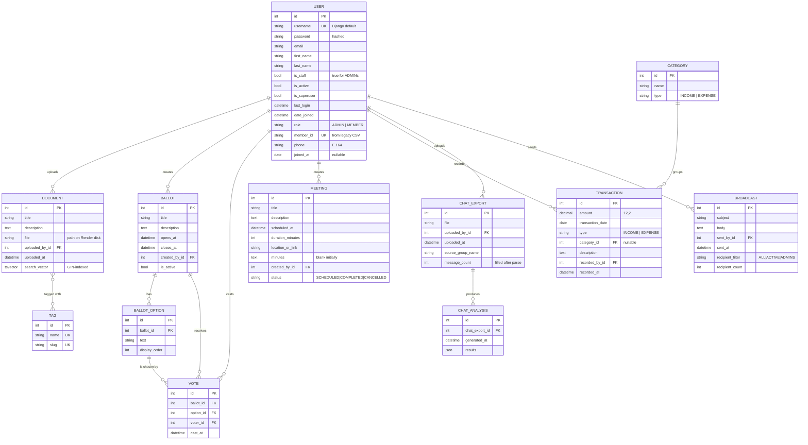

# Organization X System — Database ERD

**Owner:** Vladimer + Harsh · **Status:** Draft v0.1 (Week 0) · **Last updated:** 2026-05-23

This document is the source of truth for the database schema. The Django models in code must match what's described here; if the code disagrees with this doc, fix one or the other and ship the change in the same PR. Every dev should read this before defining any model field.

> Companion documents: [Project_Plan_Org_X.md](Project_Plan_Org_X.md) · [Architecture.md](Architecture.md)

---

## 1. Entity-relationship diagram

The diagram shows every persisted entity, the relationships between them, and which Django app owns each table. Cardinality follows crow's-foot conventions (`||--o{` = one-to-many, `}|--||` = many-to-one required).



---

## 2. Tables (per app)

Field-level detail. Django automatically adds an `id` primary key (`BigAutoField`) to every model unless overridden — listed here for completeness but not repeated in prose. Every `ForeignKey` becomes a `<name>_id` column at the DB level.

### 2.1 `members` app

#### `members_user`

Custom user model extending `django.contrib.auth.models.AbstractUser`. Declared in `members/models.py` and pointed to by `AUTH_USER_MODEL = "members.User"` in `settings.py`. **Set this from day one — switching custom user models later is painful.**

| Field | Type | Constraints | Notes |
|---|---|---|---|
| `id` | `BigAutoField` | PK | |
| `username` | `CharField(150)` | unique, not null | Django default. We use email-style usernames or member_id. |
| `password` | `CharField(128)` | not null | Hashed via PBKDF2. Never plain. |
| `email` | `EmailField` | not null, unique | Used for broadcasts and password reset (when added). |
| `first_name` | `CharField(150)` | nullable | |
| `last_name` | `CharField(150)` | nullable | |
| `is_staff` | `BooleanField` | default False | True for `ADMIN`s — controls Django Admin access. |
| `is_active` | `BooleanField` | default True | Set False to soft-disable a member. |
| `is_superuser` | `BooleanField` | default False | Reserved for Lado / one team account. |
| `last_login` | `DateTimeField` | nullable | Auto-updated on login. |
| `date_joined` | `DateTimeField` | default `now` | When the User row was created in *our* system. |
| `role` | `CharField(10)` | choices `ADMIN`/`MEMBER`, default `MEMBER` | Our role flag, separate from `is_staff`. |
| `member_id` | `CharField(20)` | unique, not null | Carried over from legacy CSV; for new members generate `M-<6-digit>`. |
| `phone` | `CharField(20)` | nullable | Normalized to E.164 (`+995...`) during migration. |
| `joined_at` | `DateField` | nullable | When the person joined the *organization* (may predate `date_joined`). |

**Indexes:** `username` (unique, default), `email` (unique), `member_id` (unique). Add a non-unique index on `role` if filtering by it becomes common.

**Migration note:** Mr H creates the custom user model in the very first migration — *before* `makemigrations` is ever run with the default user. If you've already migrated with `auth.User`, you must reset migrations (acceptable in week 0, painful later).

---

### 2.2 `documents` app

#### `documents_tag`

| Field | Type | Constraints | Notes |
|---|---|---|---|
| `name` | `CharField(60)` | unique | Display name, e.g. "Annual Report". |
| `slug` | `SlugField(60)` | unique | URL-safe form, auto-generated from name. |

#### `documents_document`

| Field | Type | Constraints | Notes |
|---|---|---|---|
| `title` | `CharField(200)` | not null | |
| `description` | `TextField` | nullable | Free-text, included in search. |
| `file` | `FileField` | not null | `upload_to="documents/%Y/%m/"`, max 50 MB. |
| `uploaded_by` | `FK members.User` | not null, `on_delete=PROTECT` | Don't lose audit trail when a user is deleted; require explicit cleanup. |
| `uploaded_at` | `DateTimeField` | `auto_now_add=True` | |
| `search_vector` | `SearchVectorField` | nullable | Postgres-only. Populated on save (signal/override). |

#### `documents_document_tags` (auto-generated M2M through table)

Django creates this automatically for the `Document.tags = ManyToManyField(Tag)` relationship. You don't define it in code; you can `Document.objects.filter(tags__name="annual")` and Django builds the join.

| Field | Type | Constraints |
|---|---|---|
| `id` | `BigAutoField` | PK |
| `document_id` | FK to `documents_document` | not null |
| `tag_id` | FK to `documents_tag` | not null |

Composite unique constraint on `(document_id, tag_id)` — Django adds it.

**Indexes:**
- `search_vector` — **GIN index** required for fast full-text search. Added in a manual migration:
  ```python
  from django.contrib.postgres.indexes import GinIndex
  class Meta:
      indexes = [GinIndex(fields=["search_vector"])]
  ```
- `uploaded_at` — for "newest first" listing, add a regular `db_index=True`.

**Search-vector population.** Either override `Document.save()` or use a `post_save` signal to compute `search_vector = SearchVector('title', weight='A') + SearchVector('description', weight='B')`. Document this clearly — it's the kind of "magic" that breaks silently.

---

### 2.3 `voting` app

#### `voting_ballot`

| Field | Type | Constraints | Notes |
|---|---|---|---|
| `title` | `CharField(200)` | not null | |
| `description` | `TextField` | nullable | |
| `opens_at` | `DateTimeField` | not null | |
| `closes_at` | `DateTimeField` | not null | |
| `created_by` | `FK members.User` | not null, `on_delete=PROTECT` | |
| `is_active` | `BooleanField` | default True | Admin can soft-disable a ballot. |

**Validation:** `closes_at > opens_at` enforced in `clean()`.

#### `voting_ballotoption`

| Field | Type | Constraints | Notes |
|---|---|---|---|
| `ballot` | `FK Ballot` | not null, `on_delete=CASCADE` | Deleting a ballot deletes its options. |
| `text` | `CharField(200)` | not null | |
| `display_order` | `PositiveSmallIntegerField` | default 0 | Sort order on the form. |

#### `voting_vote`

The integrity-critical table.

| Field | Type | Constraints | Notes |
|---|---|---|---|
| `ballot` | `FK Ballot` | not null, `on_delete=PROTECT` | Don't lose votes by accident. |
| `option` | `FK BallotOption` | not null, `on_delete=PROTECT` | |
| `voter` | `FK members.User` | not null, `on_delete=PROTECT` | |
| `cast_at` | `DateTimeField` | `auto_now_add=True` | |

**Critical constraint:** `unique_together = ("ballot", "voter")`. This is the DB-level safety net for "one vote per member per ballot." The view layer also checks this and uses `transaction.atomic()`, but the unique constraint catches anything that slips through.

**Cross-table integrity (not enforced at DB level, must be enforced in app layer):** `vote.option.ballot_id == vote.ballot_id`. A naïve form would let you submit a Vote where the option belongs to a different ballot. The cast-vote view must validate this before saving.

**Indexes:** the `unique_together` creates a composite index on `(ballot_id, voter_id)`, which is also the most common query — perfect.

**Privacy note:** votes are *not* anonymous. The `voter_id` FK is here for audit and for the "have you already voted?" check. The report should disclose this — true secret ballot is out of scope.

---

### 2.4 `meetings` app

#### `meetings_meeting`

| Field | Type | Constraints | Notes |
|---|---|---|---|
| `title` | `CharField(200)` | not null | |
| `description` | `TextField` | nullable | |
| `scheduled_at` | `DateTimeField` | not null | UTC stored; rendered in local TZ. |
| `duration_minutes` | `PositiveSmallIntegerField` | default 60 | |
| `location_or_link` | `CharField(500)` | nullable | A Zoom URL, Meet URL, or physical address. **Not validated** as a URL — admins paste freely. |
| `minutes` | `TextField` | blank | Filled in after the meeting. |
| `created_by` | `FK members.User` | not null, `on_delete=PROTECT` | |
| `status` | `CharField(15)` | choices `SCHEDULED`/`COMPLETED`/`CANCELLED`, default `SCHEDULED` | |

**Indexes:** `scheduled_at` (`db_index=True`) for upcoming-meetings query.

---

### 2.5 `finance` app

#### `finance_category`

| Field | Type | Constraints | Notes |
|---|---|---|---|
| `name` | `CharField(60)` | not null | "Membership Dues", "Office Rent", etc. |
| `type` | `CharField(10)` | choices `INCOME`/`EXPENSE`, not null | A category is income-only or expense-only. |

Uniqueness: `unique_together = ("name", "type")` — same name allowed under both types if it ever makes sense.

#### `finance_transaction`

| Field | Type | Constraints | Notes |
|---|---|---|---|
| `amount` | `DecimalField(max_digits=12, decimal_places=2)` | not null, `>= 0` | Positive number; sign comes from `type`. |
| `transaction_date` | `DateField` | not null | When the money moved (not when it was logged). |
| `type` | `CharField(10)` | choices `INCOME`/`EXPENSE`, not null | Stored separately in case `category` is null. |
| `category` | `FK Category` | nullable, `on_delete=SET_NULL` | Optional — uncategorized entries allowed. |
| `description` | `TextField` | nullable | |
| `recorded_by` | `FK members.User` | not null, `on_delete=PROTECT` | |
| `recorded_at` | `DateTimeField` | `auto_now_add=True` | |

**Cross-field validation:** if `category` is set, `transaction.type == category.type`. Enforced in `clean()`.

**Indexes:** `transaction_date` and `type` for the summary aggregations. Add a composite if needed: `(type, transaction_date)`.

---

### 2.6 `whatsapp` app

#### `whatsapp_chatexport`

| Field | Type | Constraints | Notes |
|---|---|---|---|
| `file` | `FileField` | not null | `upload_to="whatsapp/%Y/%m/"`. |
| `uploaded_by` | `FK members.User` | not null, `on_delete=PROTECT` | |
| `uploaded_at` | `DateTimeField` | `auto_now_add=True` | |
| `source_group_name` | `CharField(200)` | nullable | Captured from the export filename or admin input. |
| `message_count` | `PositiveIntegerField` | default 0 | Filled in after parsing. |

#### `whatsapp_chatanalysis`

| Field | Type | Constraints | Notes |
|---|---|---|---|
| `chat_export` | `FK ChatExport` | not null, `on_delete=CASCADE` | Analyses die with their export. |
| `generated_at` | `DateTimeField` | `auto_now_add=True` | |
| `results` | `JSONField` | not null, default `dict` | See "Shape of `results`" below. |

#### `whatsapp_broadcast`

| Field | Type | Constraints | Notes |
|---|---|---|---|
| `subject` | `CharField(200)` | not null | |
| `body` | `TextField` | not null | Plain text in v1. HTML email is out of scope. |
| `sent_by` | `FK members.User` | not null, `on_delete=PROTECT` | |
| `sent_at` | `DateTimeField` | `auto_now_add=True` | |
| `recipient_filter` | `CharField(20)` | choices `ALL`/`ACTIVE`/`ADMINS`, not null | How recipients were selected. |
| `recipient_count` | `PositiveIntegerField` | not null | Snapshot at send time — recipients aren't stored individually in v1. |

---

## 3. Shape of `ChatAnalysis.results`

The `results` JSONField is intentionally schemaless so analytics can iterate without migrations. The shape stabilizes by end of Sprint 3:

```json
{
  "summary": {
    "total_messages": 1842,
    "unique_senders": 47,
    "date_range": {"first": "2026-01-04", "last": "2026-04-29"},
    "media_message_count": 312,
    "text_message_count": 1530
  },
  "per_user": [
    {"name": "John D.", "messages": 187, "media": 22, "avg_sentiment": 0.34},
    {"name": "Jane S.", "messages": 142, "media": 8,  "avg_sentiment": 0.18}
  ],
  "peak_hours": [
    {"hour": 0, "count": 12}, {"hour": 1, "count": 4} /* ...24 entries */
  ],
  "frequency": {
    "daily":  [{"date": "2026-04-29", "count": 47}, /* ... */],
    "weekly": [{"iso_week": "2026-W17", "count": 312}, /* ... */]
  },
  "sentiment": {
    "positive": 0.42,
    "neutral":  0.45,
    "negative": 0.13
  },
  "top_influencers": [
    {"name": "John D.",  "score": 0.87, "messages": 187, "replies_received": 96},
    {"name": "Jane S.",  "score": 0.71, "messages": 142, "replies_received": 71}
  ],
  "spam_flags": [
    {"sender": "Anon X", "reason": "promotional_keywords", "examples": [/* msg ids */]}
  ]
}
```

Lado writes the parser/analytics so this shape lives in `whatsapp/analytics.py` as the canonical contract. The dashboard view reads from this; if the shape changes, the dashboard breaks visibly and gets fixed in the same PR.

---

## 4. Indexes summary

Beyond automatic indexes (PKs, FKs, unique fields), add these explicitly:

| Table | Field(s) | Type | Why |
|---|---|---|---|
| `documents_document` | `search_vector` | **GIN** | Full-text search. |
| `documents_document` | `uploaded_at` | btree | "Newest first" listing. |
| `meetings_meeting` | `scheduled_at` | btree | Upcoming-meetings query. |
| `finance_transaction` | `transaction_date` | btree | Date-range filtering for summary. |
| `finance_transaction` | `(type, transaction_date)` | btree composite | Income-vs-expense by month. |
| `voting_vote` | `(ballot_id, voter_id)` | btree composite | Already created by `unique_together`. |

Don't pre-optimize beyond these. If a page is slow, add `select_related` / `prefetch_related` first; only add indexes when you have a real slow query.

---

## 5. ON DELETE policies (rationale)

`on_delete` is a real choice, not a default. Here's the team's policy and why:

- **`PROTECT`** for any `created_by` / `recorded_by` / `uploaded_by` / `voter` FK. We never want a User deletion to silently orphan or destroy audit-relevant rows. If you need to delete a User, the script must reassign or explicitly delete their content first.
- **`CASCADE`** for parent-child relationships where the child has no meaning without the parent: `BallotOption` belongs to `Ballot`; `ChatAnalysis` belongs to `ChatExport`. Deleting the parent deletes the children.
- **`SET_NULL`** for optional references where the related row is metadata: `Transaction.category` (a transaction without a category is still meaningful).

If you find yourself reaching for `on_delete=models.CASCADE` on a `User` FK, stop and ask the team. We almost never want it.

---

## 6. Migrations and seed data

**Migrations.**
- Mr H owns the migration story. Every model change ships as a Django migration committed to the repo.
- `python manage.py makemigrations` locally → review the generated file → commit alongside the model change.
- Never edit a migration that's already been applied to `main` / production. If you need to fix something, write a new migration.
- Two custom migrations are required up front:
  1. The custom `User` model (week 0, before any other migration).
  2. The GIN index on `documents_document.search_vector` (sprint 2, when documents lands).

**Seed data.** Mr K's `seed_data.py` management command (sprint 1) re-creates a clean demo dataset every time it runs:

- 5 admin users + 20 member users with realistic names/emails
- 3 tags ("Reports", "Notices", "Minutes") and 6 documents tagged across them
- 2 ballots: one open (closes_at in future), one closed (results visible)
- 4 meetings: 2 scheduled, 1 completed with minutes, 1 cancelled
- 2 income categories + 3 expense categories, 15 transactions
- 1 ChatExport + ChatAnalysis with realistic JSON in `results`
- 0 broadcasts (sending real emails from seed scripts is a foot-gun)

The 4,000-row real migration is separate — owned by Mr H, runs once, not part of `seed_data`. They don't conflict because seed data goes in first on a clean DB, and the real migration runs only on production.

---

## 7. Naming conventions

- **Models:** `PascalCase` singular (`Document`, `BallotOption`, `Transaction`).
- **Tables:** `<app>_<model>` lowercase, Django-default. Don't override `db_table`.
- **FK fields:** `<thing>` (e.g. `created_by`, not `created_by_user`). The `_id` suffix appears at the DB level, not in Python code.
- **Choice constants:** `UPPER_SNAKE` (e.g. `ROLE_ADMIN = "ADMIN"`).
- **Boolean fields:** start with `is_` or `has_` (`is_active`, `has_paid`).
- **DateTime fields:** end in `_at` (`uploaded_at`, `cast_at`).
- **Date fields:** end in `_date` (`transaction_date`).
- **Don't** prefix tables with the app name in Python (`Document`, not `DocumentsDocument`) — Django handles the namespacing at the DB level automatically.

---

## 8. Open schema questions for week 0

These need answering before sprint 1 starts. Lado + Mr H + Mr K to clear.

- **`User.username`** — what string do we use? Email? `member_id`? Both work in Django; pick one and stick to it. Recommendation: email. Members already have it, it's unique-ish, and password-reset-by-email becomes possible later.
- **Legacy `member_id` format** — the CSV may have `M0001`, `OX-1234`, or numeric IDs. Mr H needs a sample row to lock the format and write the migration regex.
- **`User.phone` validation** — strict E.164 (`+995...`) or accept anything? Strict is cleaner; loose is faster to migrate. Recommendation: accept anything in v1, normalize in the cleaning script, document the "best-effort" normalization in the report.
- **Document content extraction for search** — do we extract text from PDF/DOCX content into `search_vector`, or only index title + description + filename? Content extraction adds `pdfminer.six` / `python-docx` and a parsing step. Recommendation: title + description only in v1, content extraction as a sprint-5 stretch.
- **`Vote` privacy** — do we want a `voter_hash` field for "anonymous-ish" votes (a salted hash of `voter_id` so the audit can detect double-voting without revealing identity)? Recommendation: skip — it's security theater unless we go all-in on a token-based scheme. Disclose the limitation in the report.
- **`Broadcast.recipients`** — store the list of user IDs we sent to, or just the count? Recommendation: count only in v1. Storing 4,000-row recipient lists per broadcast bloats the DB for marginal value.
- **`ChatExport.source_group_name`** — required or optional? Recommendation: optional; many exports don't include the group name in a parseable way.

---

## 9. What's *not* in the schema (for honesty)

- **No password reset tokens.** Cut from v1 — admin resets passwords via Django Admin.
- **No email verification tokens.** Cut from v1.
- **No audit log table.** We rely on `created_by` / `recorded_by` / `uploaded_by` fields on each model. A real audit log (every change tracked) is out of scope.
- **No session table** (Django manages it internally — `django_session` is automatic, not a model we own).
- **No notifications table.** Notifications are sent and forgotten; we don't store delivery state per recipient.
- **No tags on anything except documents.** Meetings, transactions, etc. are not tagged.
- **No soft-delete.** `is_active` exists on `User` only. Other entities are hard-deleted (with the `PROTECT` policy preventing accidents).
- **No versioning** on documents, minutes, or anything else. Latest write wins.
- **No multi-tenant scoping.** Single-organization system; no `organization_id` column anywhere.
